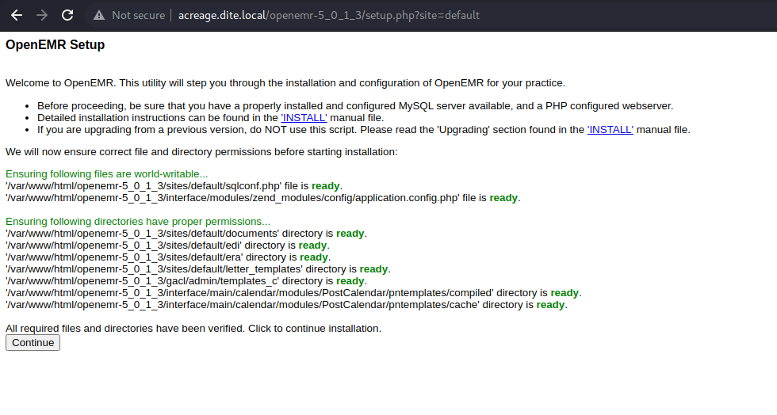
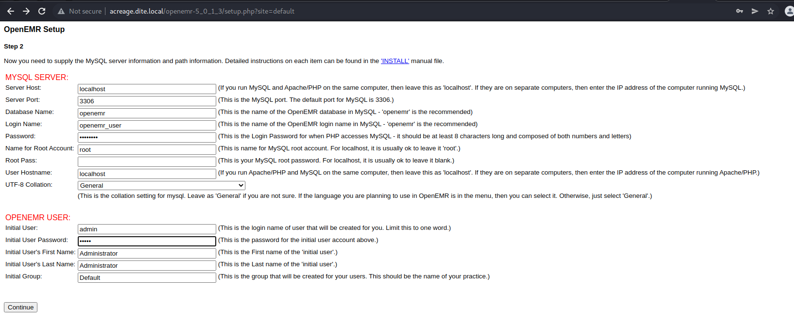
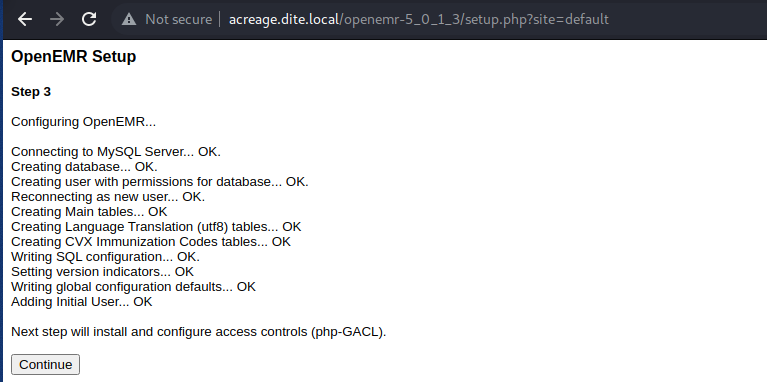
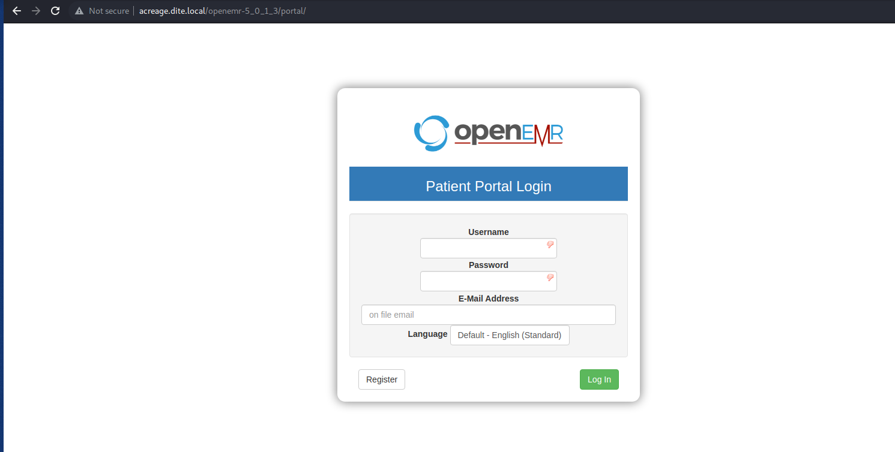
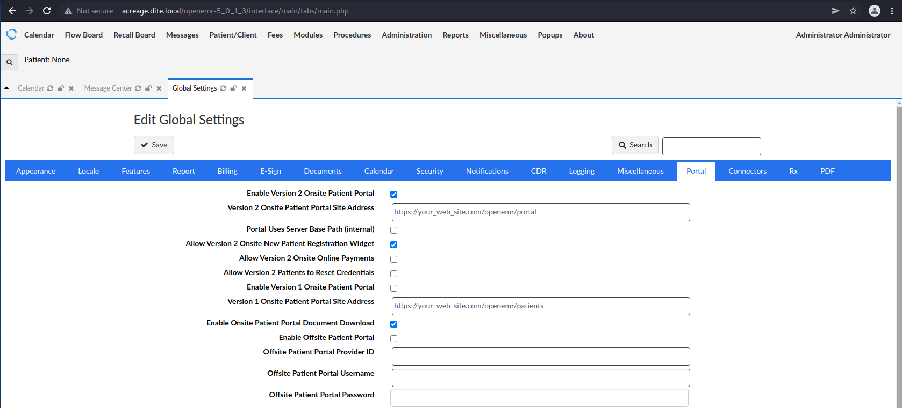
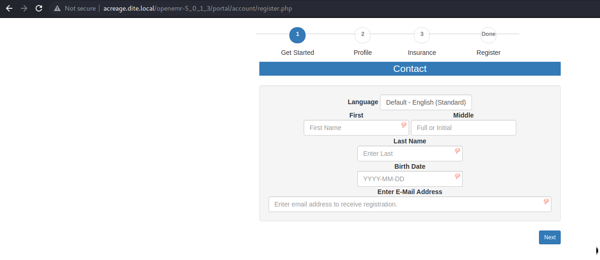
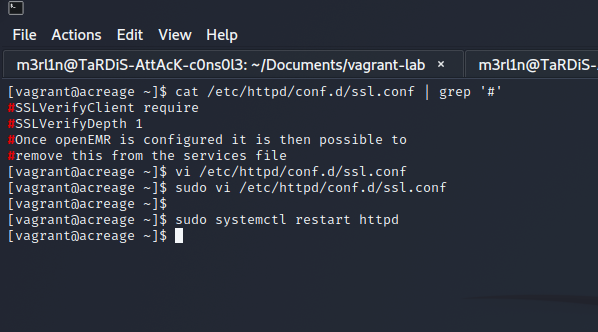

# Build Guide for Dite network 

## Status

**NTP**: Off  
**Firewall**: Off  
**Updates**: Off  
**ICMP**: On  
**IPv6**: Off  
**AV or Security**: Off
**SELinux**: Off

## Overview

**OS**: CentOS 7

**Hostname**: acreage

**Vulnerability 1**: Vulnerable web application 

**Vulnerability 2**: Misconfiguration within the docker daemon 

**Admin Username**: root  

**Admin Password**: CowabungaTimeToTrySurf8734  

**Low Priv Username**: dockerdev

**Low Priv Password**: CatchAllWaveDude7354  

**Location of local.txt**: /home/dockerdev/local.txt  

**Value of local.txt**:  c93a7db6cef3e65eb16850dc69c24b20  

**Location of proof.txt**: /root/proof.txt  

**Value of proof.txt**: 238e81ba6935e520eb5928fd03343afc

#############################################

## Required Settings

**CPU**: 1 CPU  x 1
**Memory**: 1GB  x 1
**Disk**: 10GB x 1

#### Manual configuration of root and user password on system

## Build Guide

It is possible to use a few configurations in this instance. This could be vagrant or your own configuration dependent on your general requirements. The system has too be CentOS 7 ideally.

1. Install a CentOS 7 system

Ensure you disabled the firewall
Ensure you disable SELinux on the system

2. Enable network connectivity 

The network configuration is a simple point to point interface. It might be needed to configure specific attributes to suit your environment. Though the attributes that require amending are slightly limited. A flat network should surface.

3. Prepare your environment including installing the required OS

This means ensuring the ability to run the script. This can be provided by remote storage system such as nfs or a http server, though you would need to run it locally. 

4. Review the configuration parameters for the build script within the exported variable's section.

5. Run the build script in order to start the provisioning process.

In order to test the script via vagrant run `vagrant up --no-provision` and then ssh on the local VM. Then run `bash /srv/host/post-provision.sh` (There eems to be a bug in that the script run's twice in the vm)

6. Configure the web application service

Verify application installation was successful

Set the configuration for the application database settings and default credentials. The password which you choose for the database in the script should be functional. EMR User password can be anything you wish though the EMR Databse credentials have to match what's in the SQL server.

Verify the SQL server has been configured correctly.

At this stage ensure to click continue for all the steps until you reach the final page at which point you will be redirected to the login page.

Once the login page is visible login via the default credentials `admin:admin`.

Configure the patent's portal by going to `administration > global > patient portal`, should be enabled. Verify that the online registration widget is also configured. 

Once this is done it means that we should be able to proceed to the portal page without much complication. Clicking on the register link should take us to the following page.

Once the application is configured as shown. It is possible to then proceed with the process of enabling SSL verification then restarting the apache2 service.

Once this is verified you can now go ahead and disable the http interface by commenting out the line `Listen 80` on the http interface of the apache config while leaving the https only interface.

7. Once configured accurately the server should be ready to function accordingly.

