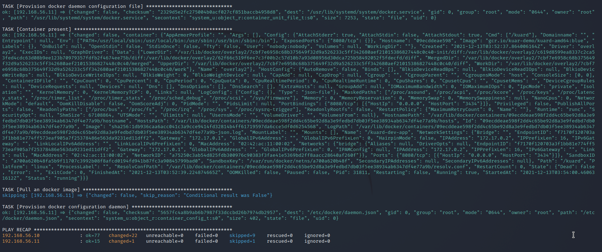
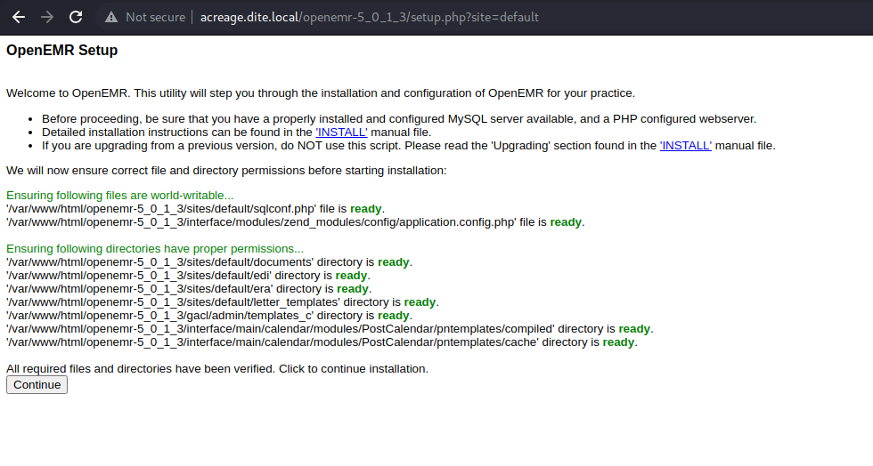
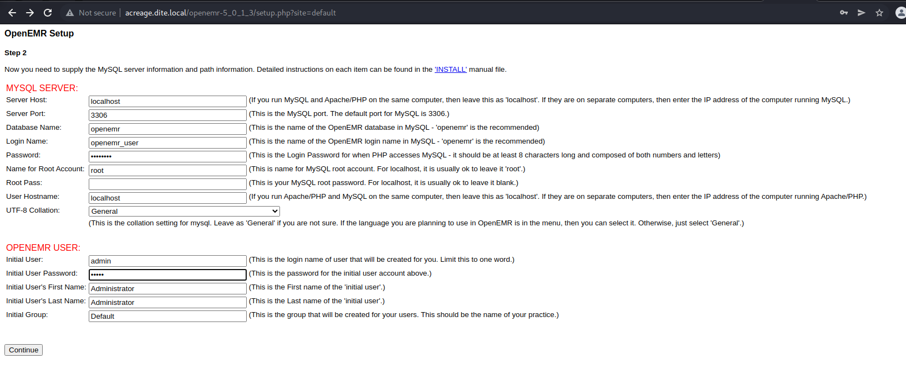
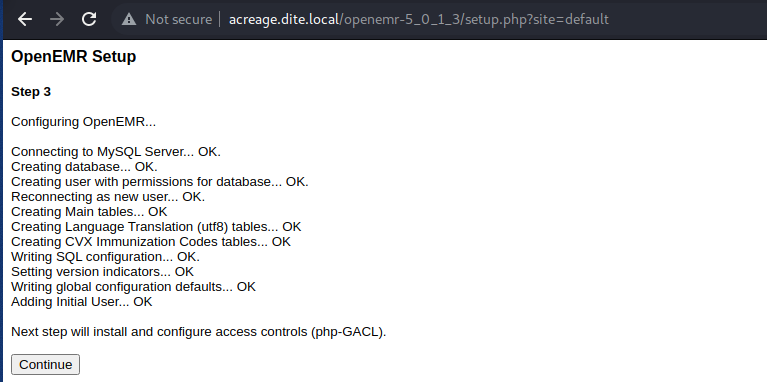
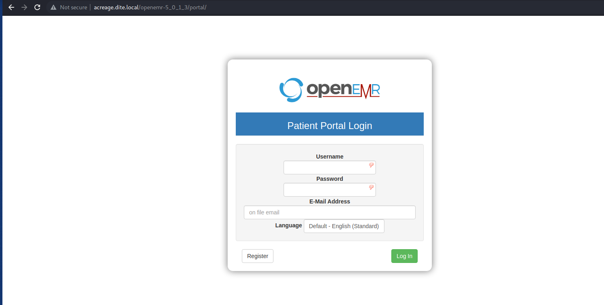
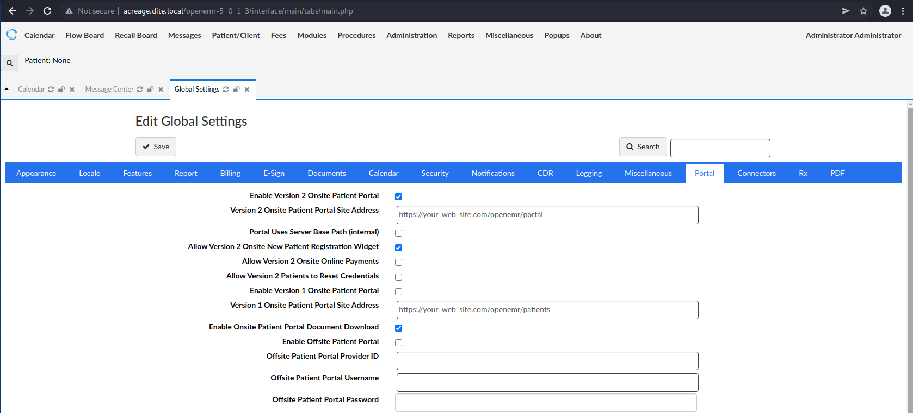
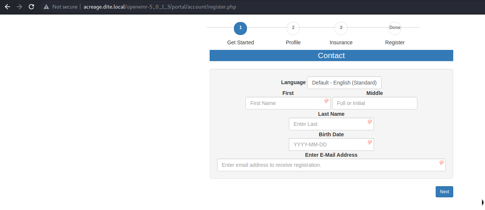
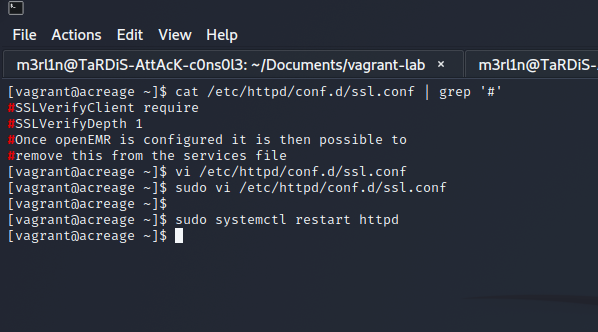

# Build Guide for Dite network 

The systems purpose is to teach the usage of diffirent types of authentication methods based on PKI. In cooprate environment their a multitude of requirements, one of the main requirements is to effectivily encrypt data. This is at rest and in transit. Thus PKI technologies have to be implemented to make this possible. Strong authentication is import, so we also aim to show how TLS can be used in order ensure to strength public facing login interfaces. To enable the ability to think lateral it also important to understand how to evalaute one's priviledges by using alternative authenication methods. Understanding these things would also enable an administrator to secure the infrasture and reduce the attack surface by adding an extra barrier to application which contian vulnarabilities.

## Status

**NTP**: Off  
**Firewall**: On  
**Updates**: Off  
**ICMP**: On  
**IPv6**: Off  
**AV or Security**: Off

## Overview

**OS**: CentOS 8

**Hostname**: acreage

**Vulnerability 1**: Vulnarable web application 

**Vulnerability 2**: Misconfigured docker daemon 

**Admin Username**: root  

**Admin Password**: CowabungaItsTimeToSurf991  

**Low Priv Username**: dockerdev

**Low Priv Password**: CatchThatWaveMyDude751  

**Location of local.txt**: /home/dockerdev/local.txt  

**Value of local.txt**:  7e3c87a8055f2adbc978814fe24fb52d8e7ebb25467a5509959f0b750cb60d6d  

**Location of proof.txt**: /root/proof.txt  

**Value of proof.txt**: c395f273ed118c4bdba3d1390b49d82de8e3b4264b91686d41f5796d3aab290a

#############################################

**OS**: CentOS 8

**Hostname**: facet

**Vulnerability 1**: SSH PKI based authentication

**Vulnerability 2**: Misconfigured daemon service

**Admin Username**: root  

**Admin Password**: CowabungaItsTimeToSurf991  

**Low Priv Username**: dockerdev

**Low Priv Password**: CatchThatWaveMyDude751  

**Location of local.txt**: /home/dockerdev/local.txt  

**Value of local.txt**: 7e3c87a8055f2adbc978814fe24fb52d8e7ebb25467a5509959f0b750cb60d6d  

**Location of proof.txt**: /root/proof.txt  

**Value of proof.txt**: c395f273ed118c4bdba3d1390b49d82de8e3b4264b91686d41f5796d3aab290a

## Required Settings

**CPU**: 1 CPU  x 2
**Memory**: 1GB  x 2
**Disk**: 10GB x 2

## Build Guide

It is possible to use a few configurations in this instance. This could be vagrant or your own configuration dependent on your general requirements. The system has too be CentOS 8 and have support for ssh.

1. Install Ubuntu CentOS system our use provided artificates

It is possible to use the provided vagrant file in order to perform this step.
This file should provision of the required attributes for this running service.

2. Enable network connectivity 

The network configuration is quite simple point to point interface. It might needed to configure specific attributes to suit yout environment. Though the attribut that require ammending are slightly limited.

3. Prepare your environment including install the required OS

If you use the provided image and vagrant then all should be funcationally well.

4. Review the confiruation parameters for the playbooks to be run againest the system.

Review the playbook and follow comments to glean an accurte understand of the confiuration. Most of the build steps are defined within the playbook as documention with assosiated files.

5. Run the provisioning process. 

The most suitbale thing is to run vagrant up --no-provision and then perform vagrant provison once all hosts are up. 

This reason for doing this is to ensure that the system it self runs using inventory. We have to ensure thet inventory when run againest a host that has not be create in virtual box as of yet.

6. Configure the web application service

Verify application installation was successful

Set the confgiuration for the application database settings and default credentials. The password which you choose for the data base in the ansible script should be funcational.

Verify the SQL server has been configured correctly.

At this stage ensure to click continue for all the steps until you reach the final page at which point you be redirected to the login page.

Once the login page is visable login via the defualt credentials `admin:admin`.

Configure the pateints portal by going to `administration > global > patient portal`, should be enabled. Verify that the online registration widget is also configured. 

Once this is done it means that we should be to able to proceed to the portal page with out much complication. Clicking on the register link should take us to the following page.

Once the application is configured as shown. It is possible to then proceed with the process of enabled SSL verification then restarting the apache2 service.

7. Once configured accurately the service should be ready to funcation accordingly.

On both systems, the alternative system is automaticaly configrued as should. Thus it should be funcational the users required level.

8. All services and system should be configured as intended.

Ensure to docker daemon user to the docker daemons group. on facet
