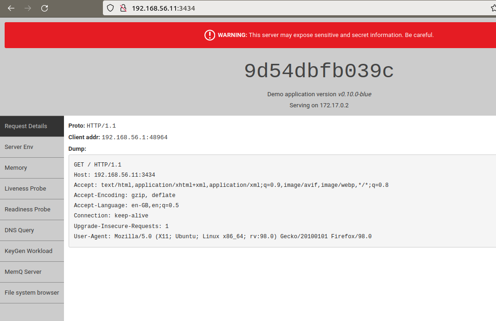
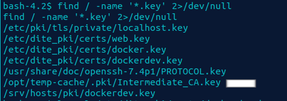
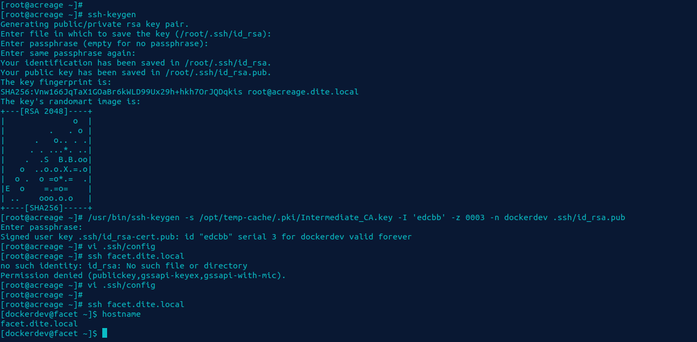
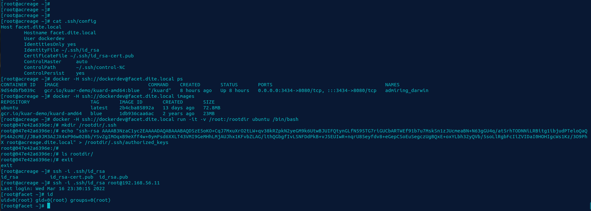

# Facet

###Should bee mentioned first part until the escalation section of guide assumes the target system to be `acreage.dite.local`

## Enumeration

Upon scanning the host system we find that there is a few ports open on the remote system. SSH and one that appears to be a web application port on `3434`. After inspecting this application we find that it seems to be a docker container. This container enables us to have further enumeration of the system.



After some inspection we find the application is not vulnerable, so we review other means of accessing the system. The SSH port could be possible based on information collected from the previous system.

We understood after inspecting the previous system that ssh based certificate authentication was enabled on the system. This was found by `sshd_config` and the file `ida_rsa-cert.pub`. Though this file won't work with authentication since it has an incorrect user principle.



This file would be located in the `/opt/temp-pki/.pki` with read permissions. This key can be used to generate or sign x509 keys.

## Exploitation

We could generate new authentication keys using ssh-keygen. We have the local user `dockerdev` which could also exist on the remote. 

Though the initial thing is to bruteforce the private intermediate key so that we can use it to generate our desired signed certificate.

```bash
cat Localofwordlist.txt | 
while read p; do 
    openssl rsa -in /opt/temp-cache/.pki/Intermediate_CA.key -out your.open.key -passin pass:$p 2>/dev/null
    RC=$?; if [ $RC -eq 0 ]; then 
echo "Password found as: " $p; break; fi ; done
```

Once the password is found which is `123456` it is then possible to sign our key's certificate as required.

Once we have the certificate configured it is then possible to generate our desired key. `/usr/bin/ssh-keygen -s /opt/temp-cache/.pki/Intermediate_CA.key -I 'edcbb' -z 0005 -n dockerdev ~/.ssh/id_rsa.pub`. 
This will output the desired certificate in the .ssh folder under `id_rsa-cert.pub`.

We also must make sure that we have correctly configured ssh config file as show below:

```
Host facet.dite.local
        Hostname facet.dite.local
        User dockerdev
        IdentitiesOnly yes
        IdentityFile ~/.ssh/id_rsa
        CertificateFile ~/.ssh/id_rsa-cert.pub
        ControlMaster     auto
        ControlPath       ~/.ssh/control-%C
        ControlPersist    yes
```

Once these things have been configured correctly it is then possible to proceed attempt to authenticate to the remote system.




Through using openssl and ssh-keygen to inspect some certificate's in the dite_certs directory which have information such as the user the key belongs to.

## Escalation

This user seems like it may have access to the docker socket. Upon login into the user account this does not seem to be the case. Attempting to run docker commands does not seem useful since the user is not part of the dockers users group. We see that it is possible to run docker ps but not any other docker commands.

We see there is a bin directory in the users home directory with docker script present on it. Upon inspecting the file we find that it is a shell script that run's the docker command with sudo and two arguments.

Upon a little more inspection of the docker page we find that docker support SSH as a daemon. 

The docker ssh method does not support ssh arguments. Thus, it was important to export the keys and user certificates to the correct location. Then configure an ssh config file. The configuration is exploitation stage should surface.

It is then possible to configure the system via `export DOCKER_HOST=ssh://dockerdev@facet.dite.local`.

It seems to be also possible to perform these steps using the `-H ssh://dockerdev@facet.dite.local` option.

The docker interface may use an alternative service. When we provide this setting including the correct ssh configuration. We find that we are able to authenticate on the remote system. This includes running docker containers.

We ensure to test this by running `docker ps` command on the system.

At this point we can proceed to use the container present on the system to mount volumes, add users or retrieve the `proof.txt` file. 

